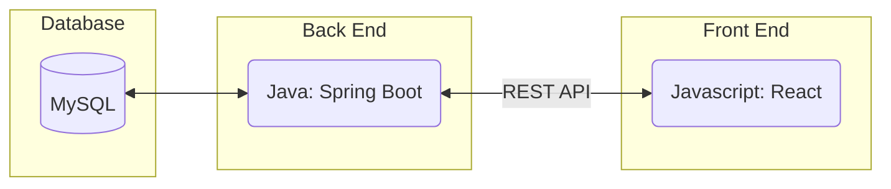
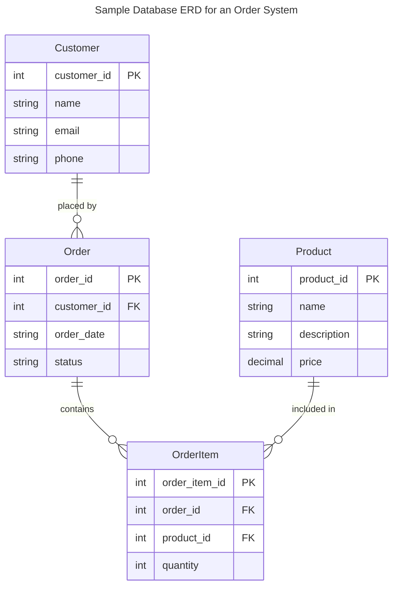
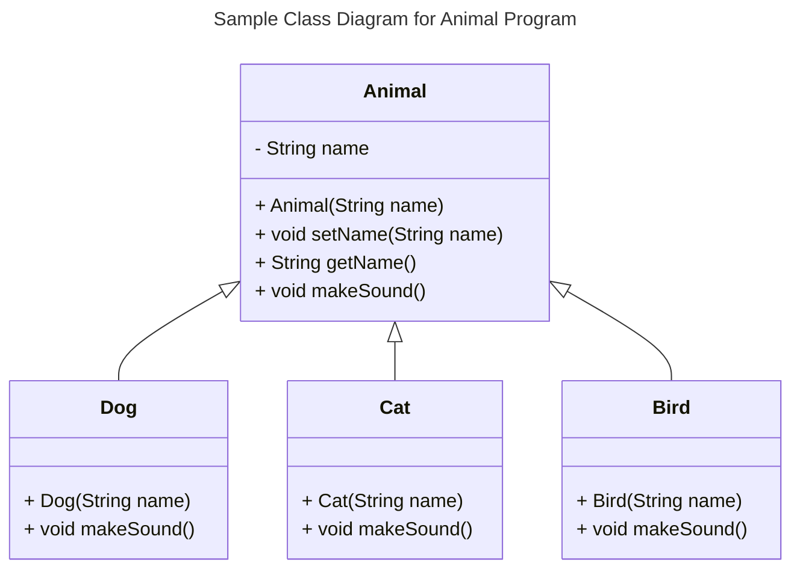
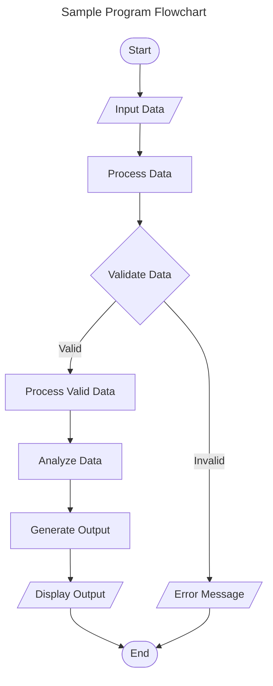
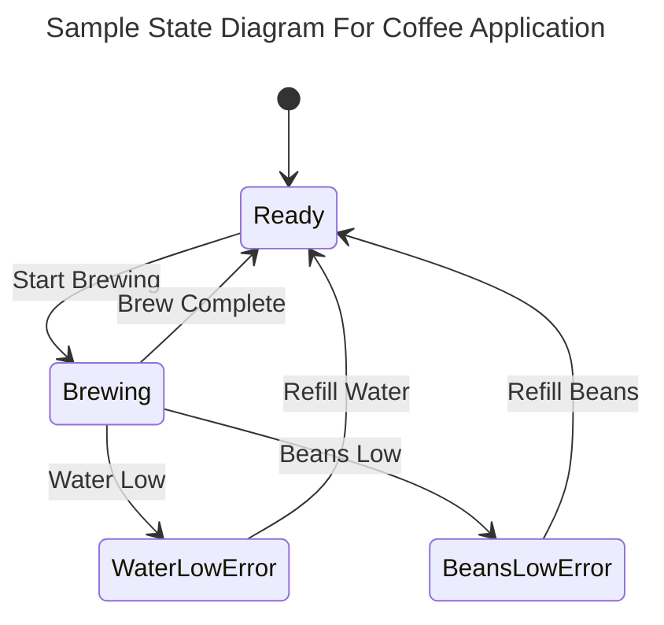
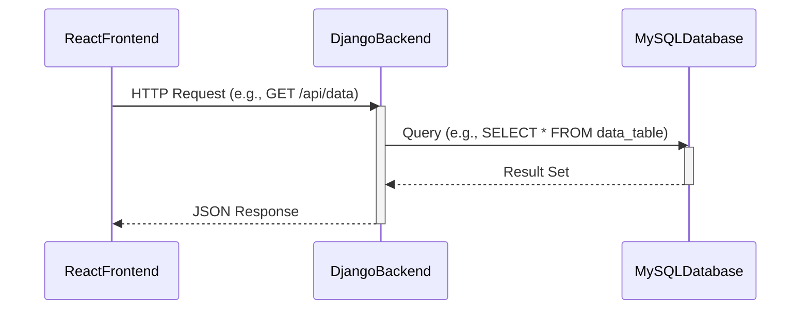

# Requirements and Specification Document

### Project Abstract
This project will be an online multiplayer variation of rock paper scissors. We decided that we wanted to make a trick based rock paper scissors game. We also wanted an easily accessible game that anyone could play and wouldn't be that hard to learn. We decided that a web app would make the game very accessible to our audience.

The rules of the game are fairly simple. Each player decides three cards that will go in the deck, the players can pick any combination of Rock, Paper, and Scissors. In addition this the user picks which card they plan on winning with. Then the deck is shuffled and three cards are distributed to the players at random. If

### Customer

The customer of this project will be any user who wants to play a fun online game with their friends.

### User Requirements

| ID  | Description                                                                                                   | Priority | Status |
| --- | ------------------------------------------------------------------------------------------------------------- | -------- | ------ |
| R1  | Users should not have to sign into the system; their current network login should be used for identification. | Med      | Open   |
| R2  | The user should be able to access the game from any full sized computer                                       | High     | Open   |
| R3  | The user should be able to access the game from mobile                                                        | Low      | Open   |
| R4  | The user should be able to play the game against other people                                                 | Med      | Open   |
| R5  | The user should be able to play against a bot                                                                 | High     | Open   |
| R6  | A user should be able to interact with the game via a UI                                                      | High     | Open   |

### Use Cases & User Stories

<!--Use cases and user stories that support the user requirements in the previous section. The use cases should be based off user stories. Every major scenario should be represented by a use case, and every use case should say something not already illustrated by the other use cases. Diagrams (such as sequence charts) are encouraged. Ask the customer what are the most important use cases to implement by the deadline. You can have a total ordering, or mark use cases with “must have,” “useful,” or “optional.” For each use case you may list one or more concrete acceptance tests (concrete scenarios that the customer will try to see if the use case is implemented).-->

Here is a sample user story from [Clean Agile](https://learning-oreilly-com.ezproxy.library.wisc.edu/library/view/clean-agile-back/9780135782002/ch03.xhtml#ch03lev1sec1) using a markdown block quote:

> As the driver of a car, in order to increase my velocity, I will press my foot harder on the accelerator pedal.

1. You
    1. Can
        1. Also
2. Use
    1. Numbered
        1. Lists

### User Interface Requirements

The UI should be easy to use and should be accessible. For us accessible looks like an easy to understand icon which, when clicked, reveals a message to the user detailing how to play the game and navigate the webiste.

### Security Requirements

Ideally we would have an OATH system

### System Requirements

Due to our goal of making this game as accessible as possible we will want this to be able to run on any web browser capable desktop. Our stretch goal is to have this app working on mobile.
### Specification

<!--A detailed specification of the system. UML, or other diagrams, such as finite automata, or other appropriate specification formalisms, are encouraged over natural language.-->

<!--Include sections, for example, illustrating the database architecture (with, for example, an ERD).-->

<!--Included below are some sample diagrams, including some example tech stack diagrams.-->

You can make headings at different levels by writing `# Heading` with the number of `#` corresponding to the heading level (e.g. `## h2`).

#### Technology Stack

#### Database

#### Class Diagram

#### Flowchart

#### Behavior

#### Sequence Diagram

### Standards & Conventions

<!--Here you can document your coding standards and conventions. This includes decisions about naming, style guides, etc.-->